# employee-management-app

###### By Ashuit

This is an employee management back-end system, created using Java Spring Boot, that could be linked to a front-end to make API calls to an employee database.
It has various CRUD (Create, Read, Update, Delete) functionalities to maintain the system and keep it updated.
It is split into two tables. A table for departments and a table for employees. 
This system is designed for companies to make it more convenient for them store, update and maintain employee data as well as department data.
This README provides an overview of its functionality as well as instructions on how to run it using Spring Boot.

#### Features:
##### Departments:
 * Add department
 * View all departments
 * Update department
 * Delete department
 * View department by ID
 * View department by name
 * View department by head of department
 * Update department name
 * Update head of department
 * Update department description

##### Employees:
 * Add employee
 * View all employees
 * Update employee
 * Delete employee
 * View employee by ID
 * View employee by first name
 * View employee by last name
 * View employee by role
 * View employee by supervisor
 * View employee by current project
 * View employee by work type
 * View employee by user name
 * Update employee age
 * Update employee role
 * Update employee department
 * Update employee supervisor
 * Update employee current project
 * Update employee work type
 * Update employee hourly wage
 * Update employee user name
 * Update employee password
 * Employee log in

#### Project Structure:
* Below is an outline of the project structure:

	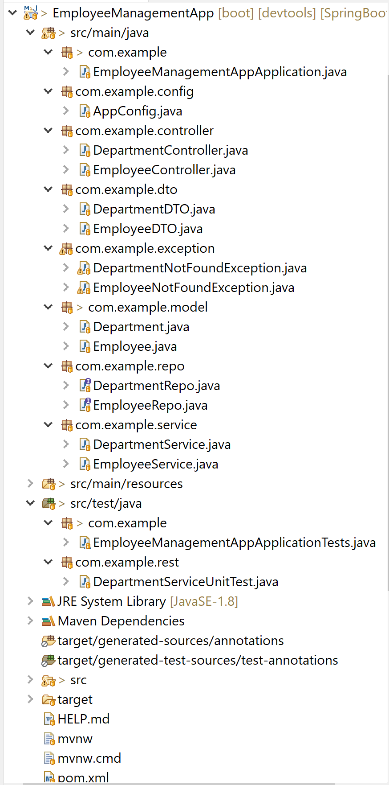

 
 
#### Database:
* Below is an ERD diagram for the database tables:

	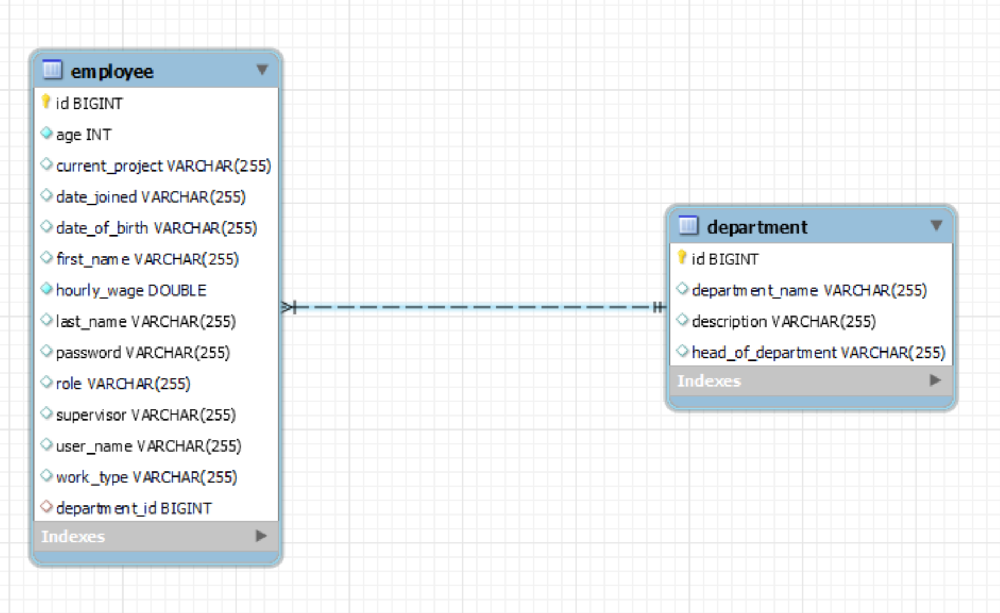

* As you can see the tables can be linked together through the Department ID

#### Execution using Postman - CRUD:

	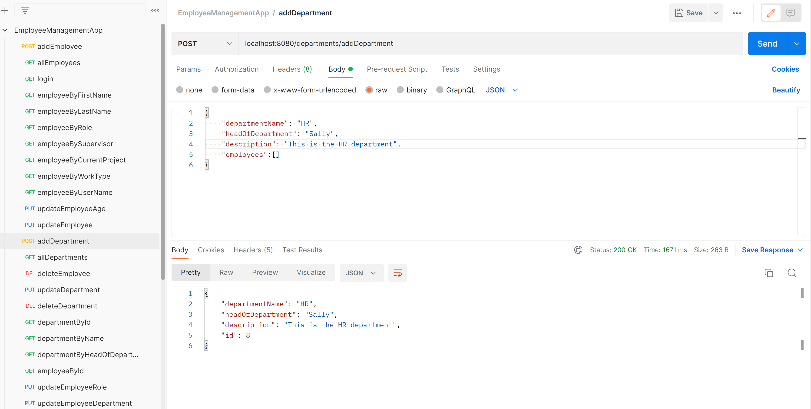

	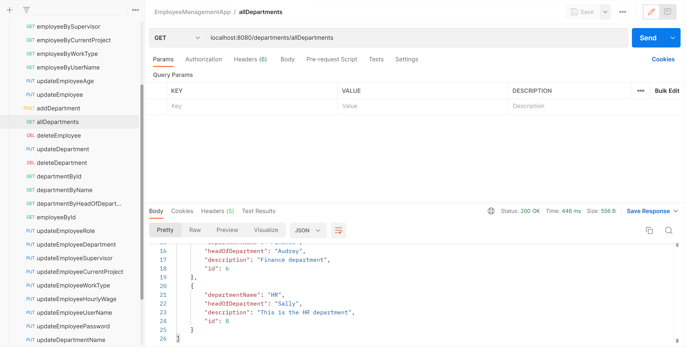

	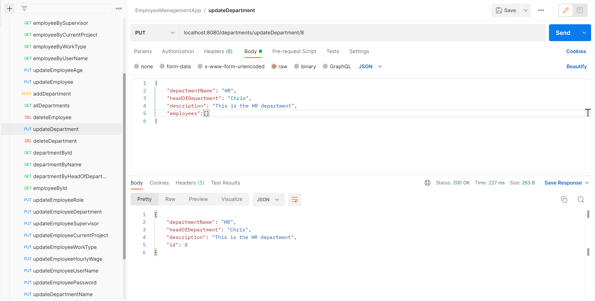

	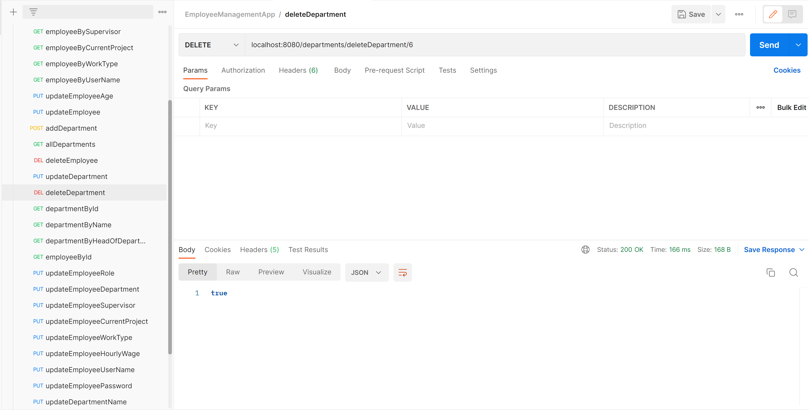

	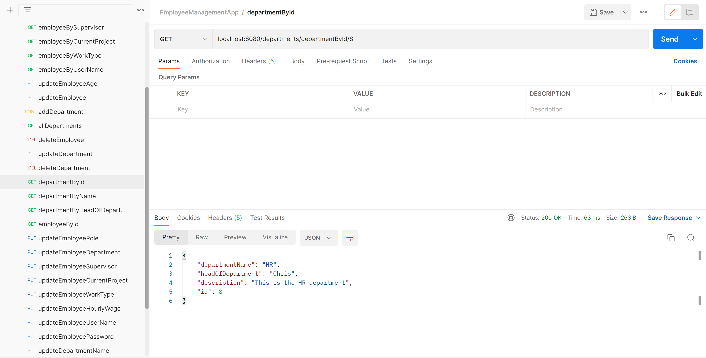

	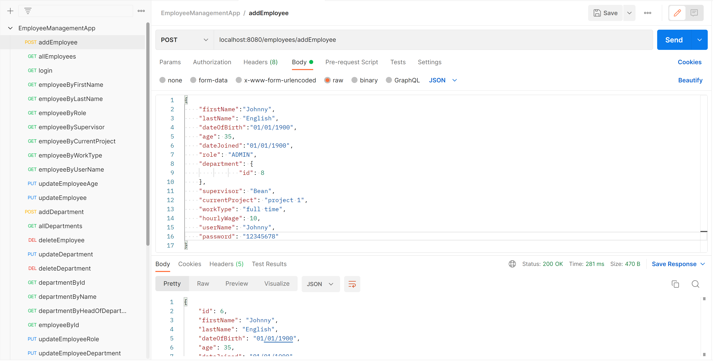

	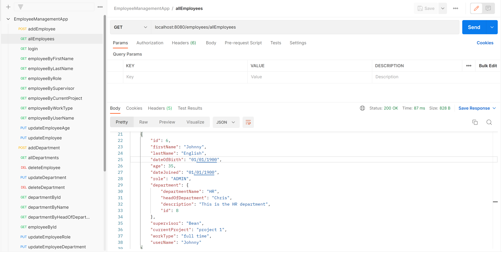

	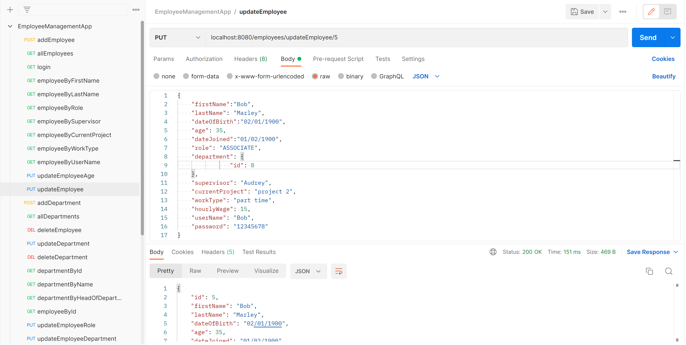

	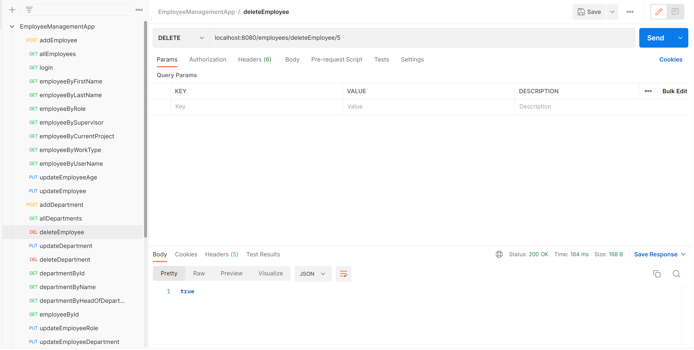

	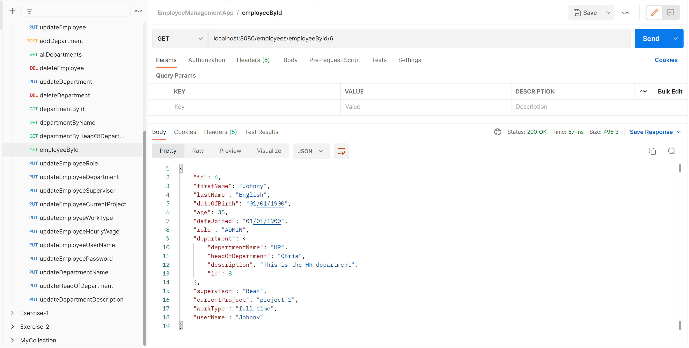

	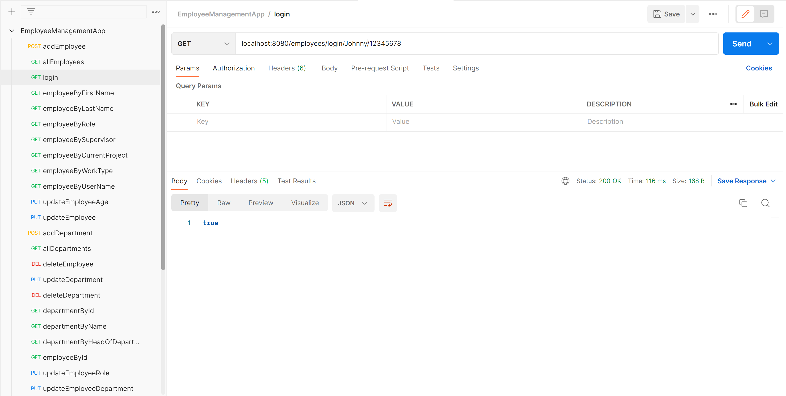

#### Executing on Spring Boot:
* Since this is a Spring Boot application it uses a TomCat server.
* The port number used is 8080, so make sure that port remains free.
* Once you have opened the project, you can right click and there two was to run it:
 
 1. Run as Java Application
 2. Run as Spring Boot App
 
* After this you can run the CRUD operations using something like Postman as shown above.

#### Testing:
* As you can see on the picture below, different types of tests were carried out on the functionality of the system and were pass.
* These were done using Mockito and JUnit testing.

	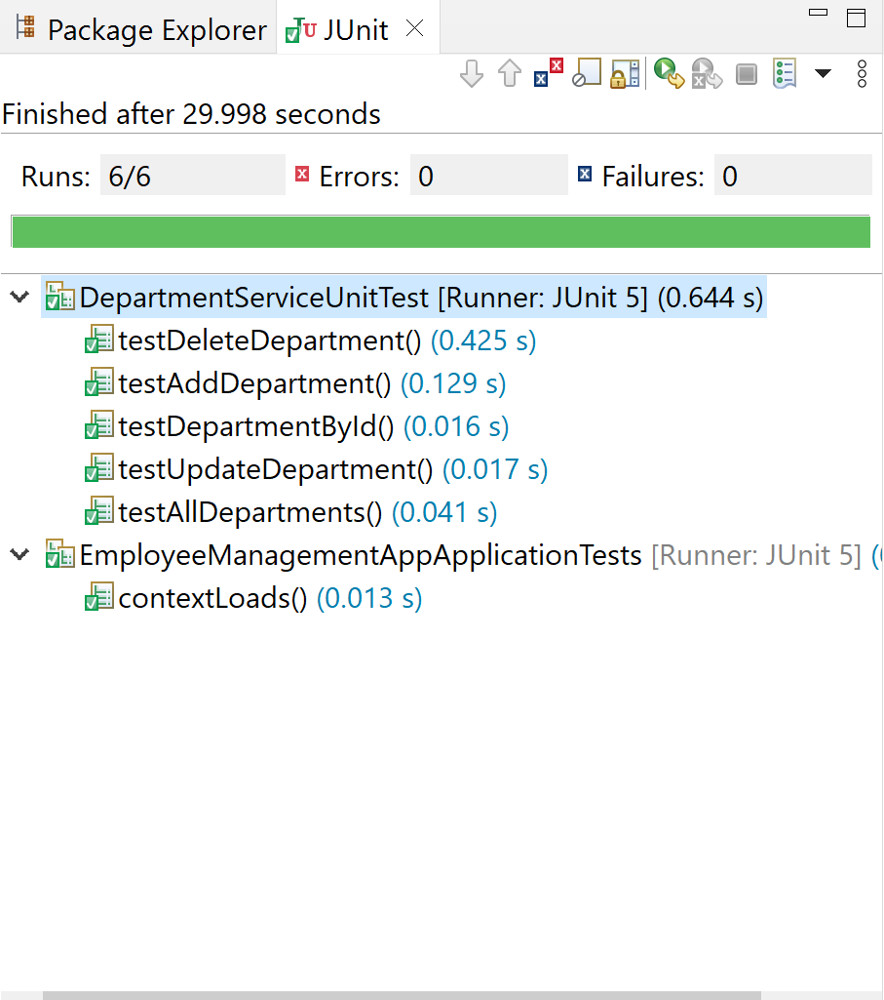

#### What I learned from this project:
In this project I learned how to use various Java and Spring Boot functionalities including LOMBOK, JUnit testing and being able to create a back-end API that can perform CRUD operations.
I expected this to be quite challenging as it was the first time I did something like this and it was also done under a quick deadline.
In the future, if given more time, I would add more operations to the CRUD functions and try to designa front-end as well.